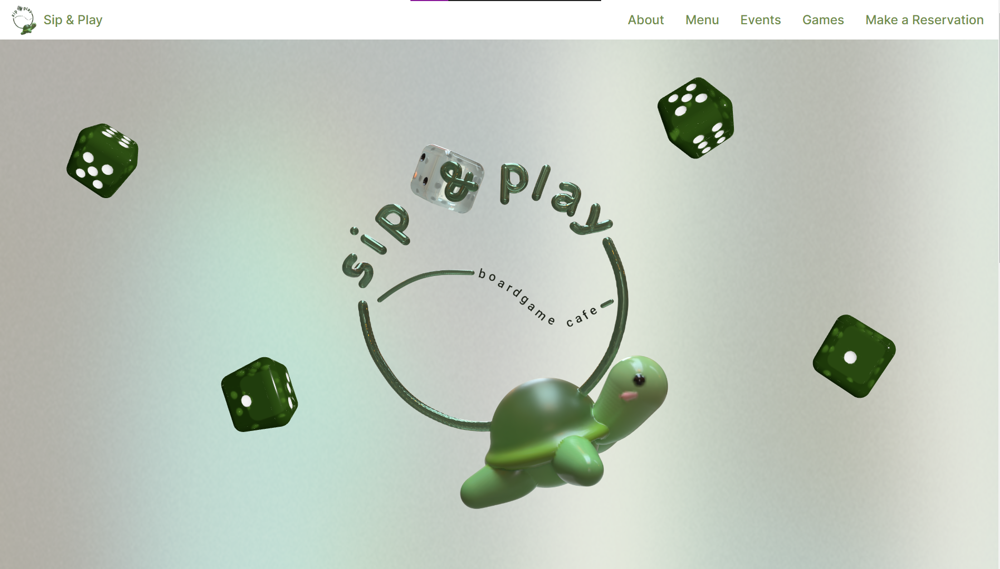
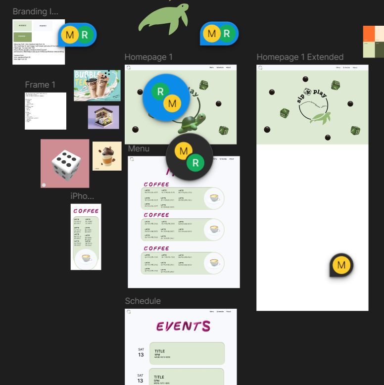
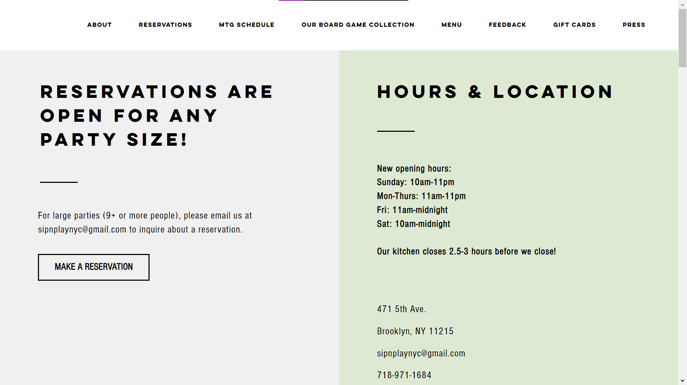
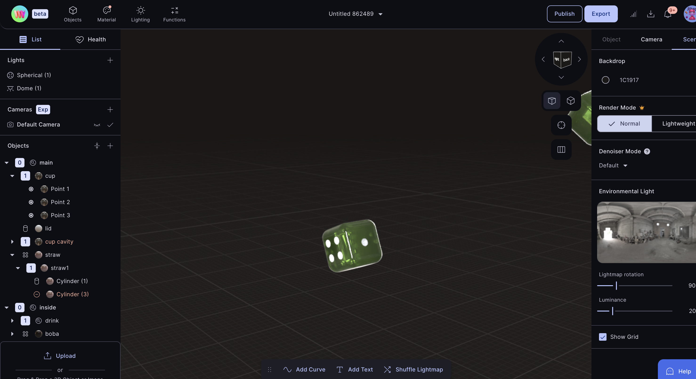
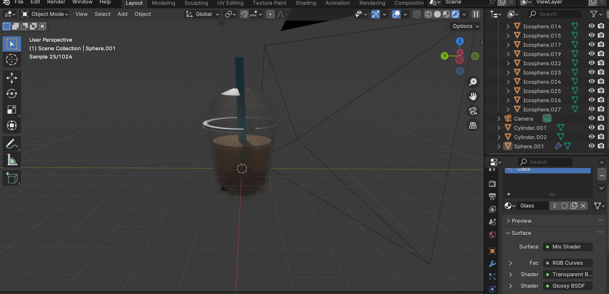

# Sip and Play

In crafting the UI design for "Sip and Play," our primary goal was to ensure a user-friendly and engaging experience. Emphasizing intuitive navigation and seamless interactions were at the forefront of our design choices. We opted for a clean and straightforward layout that prioritizes ease of use, making it simple for users to explore various features without confusion. Each element, from menus to interactive components, was meticulously wireframed using Figma, ensuring coherence and efficiency in user flow.

## Tech Stack

React + Tailwind + Vercel Deployment + Three.js + Leaflet Map + React Router

## Process

Original webpage:

Our process began with a thorough breakdown of the Sip and Play brand and its unique value propositions. We aimed to highlight the playful nature of the platform and its diverse menu offerings through consistent branding. The logo, adorned with chrome bubble letters and set against a vibrant green color scheme, embodies the energetic and inviting atmosphere we sought to create. Drawing inspiration from the original website, we identified key information and emphasized these elements to maintain continuity and user familiarity.

## 3JS

The integration of Three.js was pivotal for enhancing the visual experience, leveraging 3D elements to enrich gaming and social interactions. We developed over 8 unique Three.js assets, each customized with unique orientations and sizes to tailor the visual presentation and interactive dynamics of the platform. Additionally, we implemented separate canvases for different image views, allowing images to dynamically change and rotate upon hover, enhancing user engagement and immersion within the digital environment. For some of the assets, we even 3D modelled them ourselves, including the one above.

## Branding

For "Sip and Play," the branding revolves around a playful aesthetic highlighted by chrome bubble letters and engaging 3D assets. The color scheme leans towards vibrant greens, evoking a fresh and energetic vibe. Interactive elements like rotating menu items on hover enhance user engagement and add a dynamic touch to the user experience. This branding approach aims to create a fun and inviting atmosphere, resonating well with the target audience's preferences for lively and visually stimulating interfaces.

## SEO

SEO played a crucial role in maximizing visibility and accessibility for Sip and Play. We implemented strategies focused on keyword relevance, efficient code for fast loading speeds, and ensuring crawlability through sitemaps and structured data. Crafting effective meta tags further enhanced our search engine performance, driving organic traffic and improving overall user engagement. These efforts were instrumental in positioning Sip and Play prominently within search engine results, reaching a broader audience effectively.

## User Experience & Usability

User experience was central to our design philosophy. We incorporated bold headers, clear calls to action, and a condensed menu structure for easy navigation, particularly for things like the reservations link. We also decided to transform the game catalog from a spreadsheet into an image-driven search interface improved visual appeal and user engagement. These enhancements made browsing and exploring content more intuitive and enjoyable for users.

## Challenges & Thinking Outside the Box

Overcoming challenges, such as learning Blender for 3D modeling for the first time and integrating innovative hover effects on Three.js elements, pushed us to think outside the box. By treating the website as a dynamic game in itself, we introduced interactive elements like mini-games (e.g., tic-tac-toe) across pages, fostering deeper user engagement. These creative solutions not only addressed technical challenges but also contributed to the overall thematic coherence and user enjoyment of Sip and Play.
